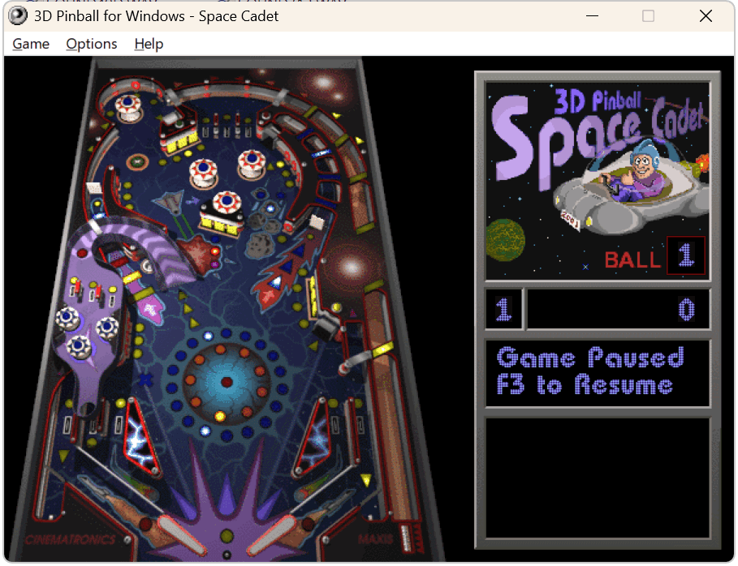

it gets its own "folder" since it has many "dependencies"..

the NT SP4 version of pinball (English) with its shit ton of "dependencies" such as wav files, font.dat, font.inf, wavemix.inf, table.bmp and all the pinball related files. should play audio correctly.  

it is patched using editbin with `/LARGEADDRESSAWARE` as well as recognise the DPI and scale the GDI correctly without glitches.. just to be sure..

it should be able to run from any place, but it is not portable, and it should be able to write registry entries and save configurations correctly.