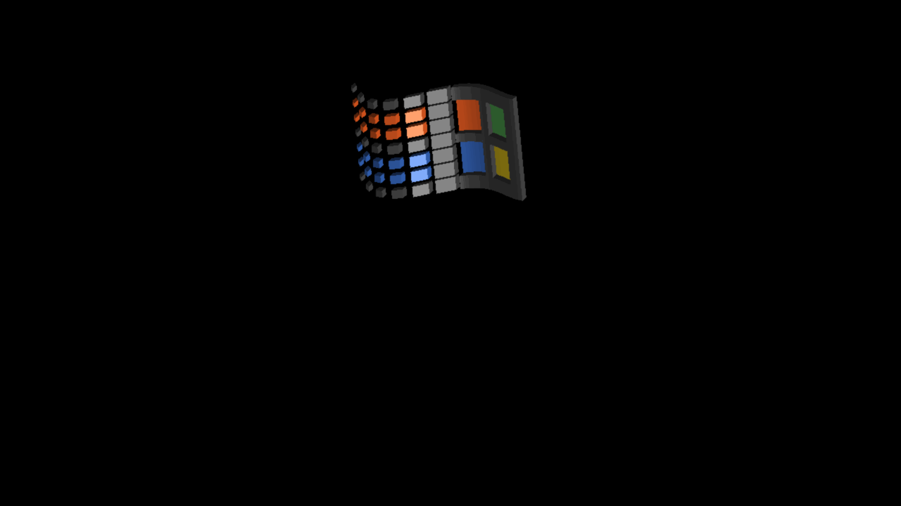
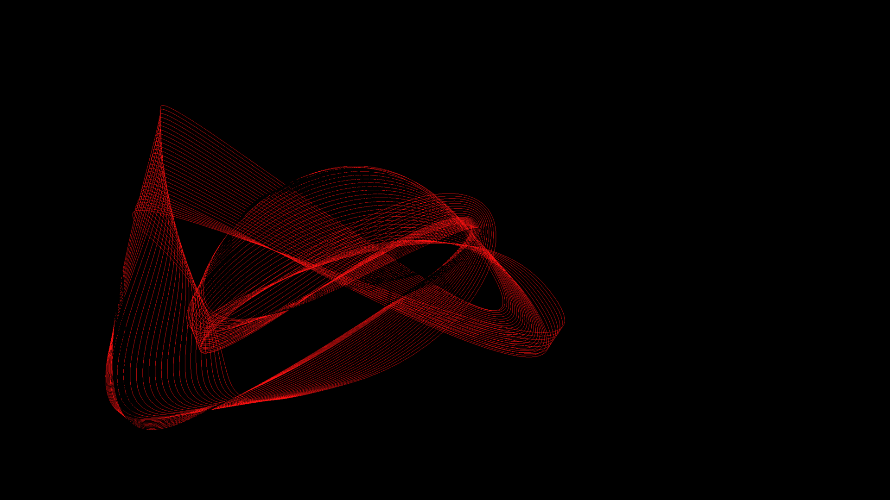
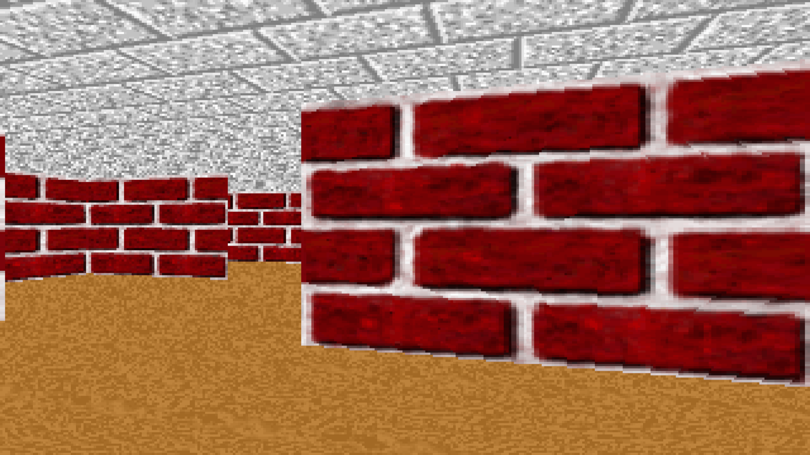
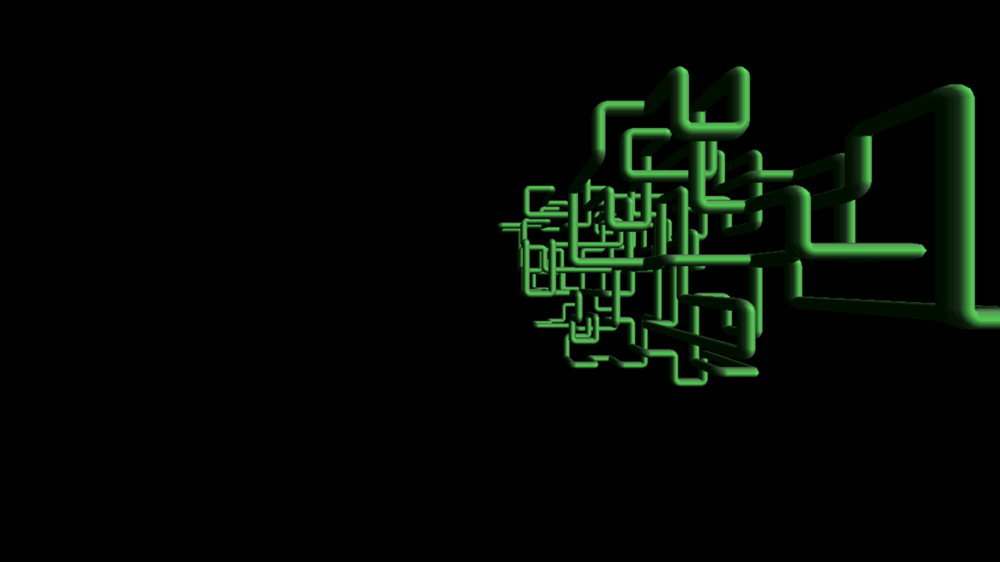
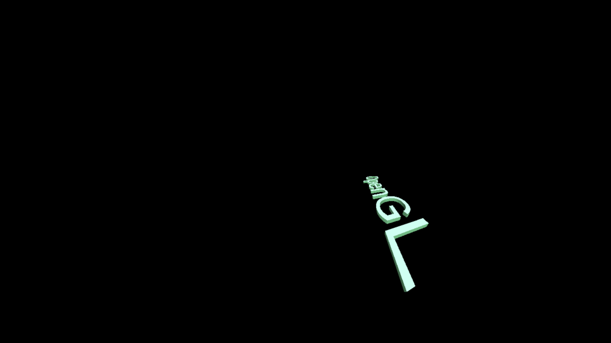

 

 

 

 

 

 

 

 

 

 

screensavers are able to store some configuration in the registry, they are 100% exe with extra functionality...

`%1` meaning the file itself.

`"%1"` opens up the configuration if they do have one.
`rundll32.exe desk.cpl,InstallScreenSaver %l` installs them (it copies them to the Windows folder I guess)
`"%1" /S` tests them, self execute 

all patched up to be able to recognise large memory as well as scale GDI correctly with high DPI screens, but that's just tiny patch, they should be able to run correctly due to how simple they are..

